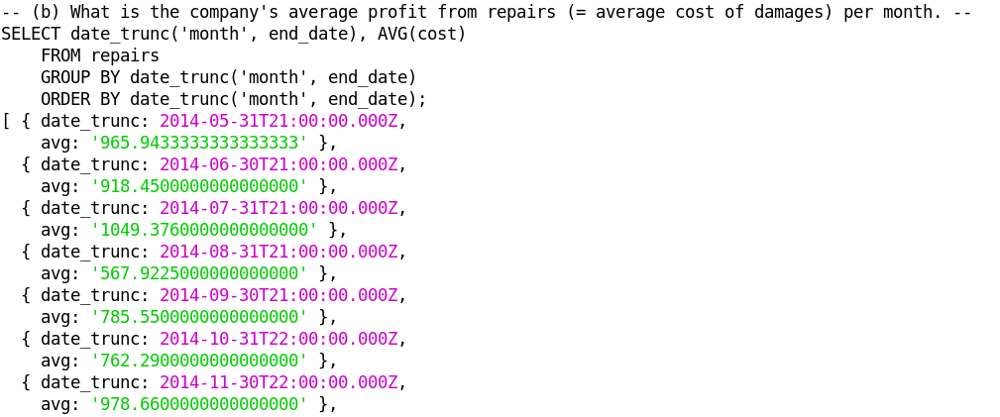
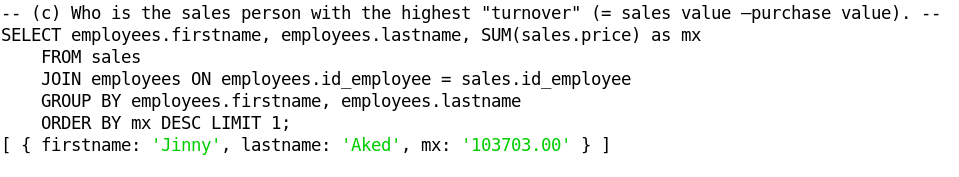
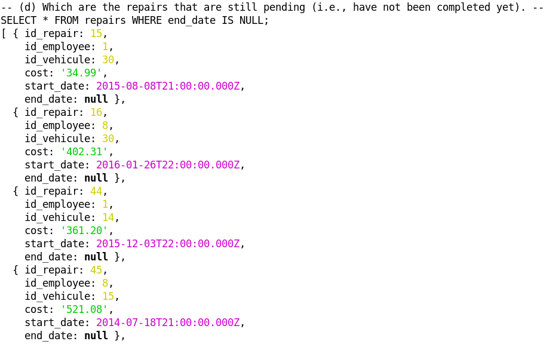
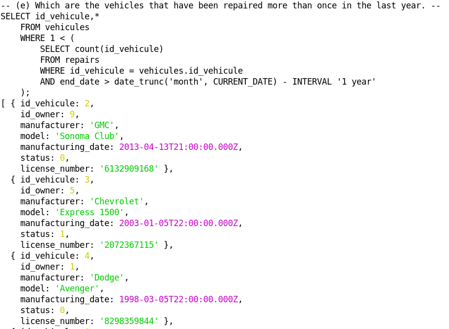

# Database #

## task 1 ##
- relational-db.jpg
- db.sql

## task 2 ##

- queries.sql

## task 3 ##

### installation & run instructions ###

- `$ cd client`
- `$ npm install pg`
- `$ node main.js`

### output screenshots ###

I didn't succeed to do the (a) query

# personal reminder #

sudo -i -u postgres
psql

in psql :
\l - list the databases
\connect company3
\dt - list the tables of the connected database

DO NOT FORGET ';' AT THE END OF EACH INSTRUCTION OR YOU GONNA BLOW YOUR MIND UP lol
